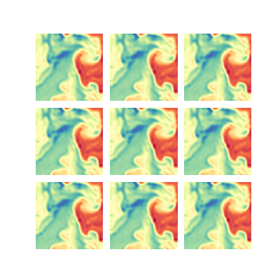

### Results
To find the best model parms the Gridsearch was ran on 50 search space between log spaced length scale and noise variance of range `10^-3 to 10^-1` and `10^-3 to 5` respectively. The entire search took around 7.5 mins to find the best params which turns out to be `length_scale=0.1` and `noise_variance=0.008408964152537146` with MSE of *0.23753136792922788*.

All the MSE for the search space are stored in `model_run.csv` file. Also, due to absensce of ground truth the model was evaluated by plotting the figure which turns out to be:

